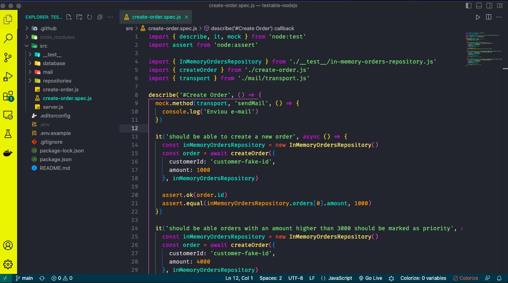

# Aplicações testáveis com Node.js

<p align="center">
  
</p>

Essa funcionalidade salva as informações do pedido no banco de dados e determina a prioridade do pedido com base no seu valor: Se o valor for maior que 5000 então é um pedido prioritário;

## Tecnologias

Esse projeto foi desenvolvido com as seguintes tecnologias:

- [Javascript](https://developer.mozilla.org/pt-BR/docs/Learn/JavaScript/First_steps/What_is_JavaScript)

## Tests

1. Se é possível criar um pedido;
2. Se os pedidos estão sendo priorizados corretamente;
3. Se o e-mail de "novo pedido" está sendo enviado;

## Dependências

Essa aplicação precisa da **v19 do Node.js** para funcionar por estar usando o Test Runner nativo da plataforma disponível somente nessa versão e nas futuras.

## Executando

Para o projeto funcionar é necessário que você esteja com o PostgreSQL executando em sua máquina. Rcomendo utilizar o Docker para subir o banco de dados:


```
docker run --name pg -e POSTGRESQL_USERNAME=docker -e POSTGRESQL_PASSWORD=docker -e POSTGRESQL_DATABASE=app -p 5432:5432 -d postgres
```

Além disso, é necessário criar um arquivo `.env` na raiz do projeto com as variáveis ambiente para conexão com o banco de dados:

```
PGUSER=postgres
PGHOST=localhost
PGPASSWORD=docker
PGDATABASE=app
PGPORT=5432
```
